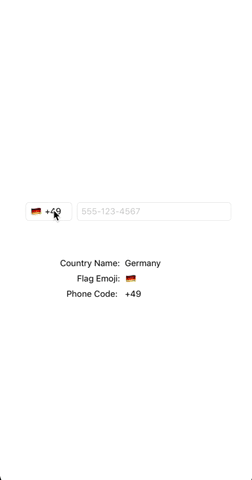

DZCountryPicker for iOS
=======================

[](https://img.shields.io/cocoapods/v/DZCountryPicker.svg)
[](https://github.com/Carthage/Carthage)
[](http://docs.launchdarkly.com/docs/ios-sdk-reference)
[](https://img.shields.io/github/languages/code-size/danialzahid94/DZCountryPicker.svg)

Overview
--------

Contrary to other available country picker libraries that store and use images of each country, `DZCountryPicker` tends to use the already available emoji images for each country by fetching the appropriate country codes. Because of this, the entire library boils down to two very simple files with no external dependencies.

It takes just one line of code to attach `DZCountryPicker` to a `UITextField`, and everything will be handled on its own. Currently the library only supports showing the countries list in a `UIPickerView`, but we're planning on supporting a drop-down `UITableView` and a presented `UITableView` in the future as well.

<p align="center"></p>

Getting started
---------------

LaunchDarkly supports multiple methods for installing the library in a project. Once installed, head over to the [SDK documentation](https://docs.launchdarkly.com/docs/ios-sdk-reference#section-getting-started) for complete instructions on getting started with using the SDK.

Installation
------------

#### Manual
Simply drop in the `DZCountryPicker` folder into your XCode project (make sure to enable "Copy items if needed" and "Create groups").

#### CocoaPods

[CocoaPods](http://cocoapods.org) is a dependency manager for Objective-C and Swift, which automates and simplifies the process of using 3rd-party libraries like LaunchDarkly in your projects. You can install it with the following command:

```bash
$ gem install cocoapods
```

1. To integrate LaunchDarkly into your Xcode project using CocoaPods, specify it in your `Podfile`:

```ruby
use_frameworks!
target 'YourTargetName' do
  pod 'DZCountryPicker', '1.0.0'
end
```

2. Then, run the following command from the project directory that contains the podfile:

```bash
$ pod install
```

Usage
-----

To attach `DZCountryPicker` to a `UITextField`, just create an object of the class, and assign it to the `UITextField`. The code might end up looking similar to the following.

```javascript
@IBOutlet weak var countryField: UITextField!
let countryPicker = CountryPicker()

override func viewDidLoad() {
    super.viewDidLoad()
    countryPicker.textField = countryField
    countryPicker.delegate = self
}
```

To get the selected country you can either access the `selectedCountry` property of the object at any time.

`DZCountryPicker` also has a delegate method to inform when a country gets selected. You can use the following delegate method for that.

```javascript
func didSelectCountry(country: Country) {
    let name = country.name
    let flag = country.flagEmoji
    let code = country.phoneCode
}
```

#### Customization

You can customize the text in the `UIPickerView` using the following properties.

```javascript
countryPicker.textColor = UIColor.blue
countryPicker.font = UIFont.systemFont(ofSize: 17.0)
```

Or directly access the `CountryPicker` object to modify other properties.
